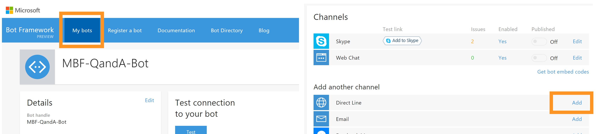
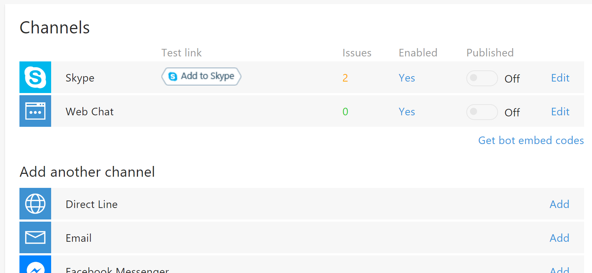
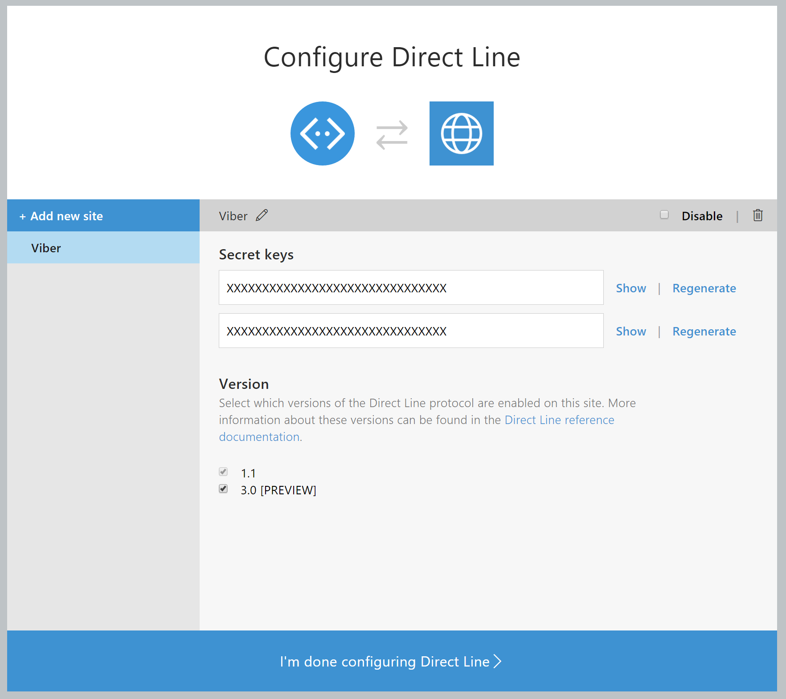
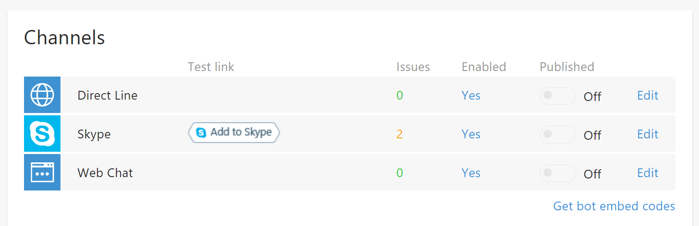

# Connect the Viber bot platform with the Microsoft Bot Framework

The Microsoft Bot Framework (MBF) provides a couple of channels which enables bot developers to easily connect their bots to a limited number of platforms (e.g. Skype, Facebook Messenger, Telegram, etc). To due the openness of MBF, it is also possible to integrate with other applications/platforms. 

This NodeJS solution demonstrates how to connect Viber's bot platform with Microsoft's Bot Framework (MBF). 

## Prerequisites

- Install Node.js ([https://nodejs.org/en/download/](https://nodejs.org/en/download/ "https://nodejs.org/en/download/"))
- Install the Viber app. Ensure that the version supports 'Public Accounts' (currently, this functioanlity is only available on [Android](https://play.google.com/store/apps/details?id=com.viber.voip&hl=de) or [iOS](https://itunes.apple.com/us/app/viber/id382617920?mt=8)). 
- An Microsoft Bot Framework account (basically, this is a Live/Hotmail/Outlook.com account). Sign up at the Microsoft Bot Framework portal [https://dev.botframework.com/](https://dev.botframework.com/ "https://dev.botframework.com/")
- *(Optional). A Microsoft Azure account if you want use the Azure Bot Service and want to host your bot on Azure. You can start your free trial on this official Azure web page ([https://azure.microsoft.com/en-us/](https://azure.microsoft.com/en-us/ "https://azure.microsoft.com/en-us/"))* 
 

## Solution Overview

The visualization below illustrates the overall setup of this implementation. 

**---------TODO-------**

Architectural Overview - Viber -> Connector Lib -> MBF Bot

**---------TODO-------**

The implementation provided in this repo provides the following packages:

1. Generic Directline library package. 
2. Client (e.g. Viber) package.

### Generic Directline Libary package
This is a generic library which wraps the currently available Directline (v3) API. The implementation is platform agnostic, which means there are no hard dependencies to any other bot platform (e.g. Viber bot platform). This allows to integrate this library into any bot platform by just providing a small piece of of platform-specific mapping code. 

**---------TODO-------**

Architectural Overview - Library Package

**---------TODO-------**

The components of the library are:

- **Core**. This module contains the core Diretline abstraction. 
- **Events**. Enumeration of events the core module will emit.
- **Activities**. Actual MBF activities. Currently, the following activity types are supported: ConversationUpdate, Message
- **Platforms**. Platform-specific mapping code. Since every platform has different data/message types, the connector has to know how to convertTo and convertFrom MBF message activities.

### Client (e.g. Viber) package

**---------TODO-------**

Architectural Overview - Client package / Integration

**---------TODO-------**

## Setup

### Create a Viber Public Account
Its super easy to create you own public Account. Just apply for a Public Account at [https://www.viber.com/en/public-accounts](https://www.viber.com/en/public-accounts "https://www.viber.com/en/public-accounts"). It shouldn't take too long until your application gets approved (in fact, if everything goes well, it's supposed to be matter of minutes).

Once it's approved start creating your Public Account by following the procedure described on Viber's Developer Hub ([https://developers.viber.com/public-accounts/index.html#public-accounts](https://developers.viber.com/public-accounts/index.html#public-accounts "https://developers.viber.com/public-accounts/index.html#public-accounts")). 

> **Important**: Ensure that you copy your authentication token. This is needed in your bot implementation and allows your Viber bot to integrate with the Public Account platform.

### Enable Direct Line support for your MBF Bot

As the MBF doesn't come with a out-of-box Viber channel, we have to use something else here. The MBF's Directline channel acts as a multi-purpose communication channel that enables the integration of MBF bots into any application. 

This channel has to enabled and configured per bot. To do so, go to the Microsoft Bot Framework portal and open the specific in your 'My Bots' collection.

No scroll down to the available channels and add the 'Direct Line' channel. 

Create a new Direct Line site, called 'Viber'. Each site comes with a pair of secrets which are required when connecting to this channel. 

Copy one the secrets (doesn't matter which one you take) as we'll need it in the Viber-MBF connector. When done finish the Direct Line configuration by clicking on the button at the bottom. Once Direct Line is enabled for a bot the channel will have the 'Enabled' property set to 'Yes'

### Linking the NPM packages

Currently the MBF Directline library package is not published to a NPM repository. However, by using `npm link` ([https://docs.npmjs.com/cli/link](https://docs.npmjs.com/cli/link "https://docs.npmjs.com/cli/link")) the library package can easily be linked to the client (e.g. Viber) package.

    cd ./lib					# navigate to the library packages directory
	npm link					# create a global link to this package

	cd ../clients/viber			# navigate to the client package (references the lib package)
	npm link mbf-directline		# link install the MBF Directline package
	

## Run

> **Note**: Viber provides some good documentation on how to get started with the bot development on the Viber platform. Just navigate to [Viber's Development Hub](https://developers.viber.com/) ([https://developers.viber.com/](https://developers.viber.com/ "https://developers.viber.com/")) and select your preferred technology ([Node.js](https://developers.viber.com/api/nodejs-bot-api/index.html), [Python](https://developers.viber.com/api/python-bot-api/index.html), [Java](https://developers.viber.com/api/java-bot-api/index.html) or [REST](https://developers.viber.com/api/rest-bot-api/index.html)). They have a demo bot on Github ([https://github.com/Viber/sample-bot-isitup](https://github.com/Viber/sample-bot-isitup "https://github.com/Viber/sample-bot-isitup")). The Viber piece in this solutions is based on their implementation.

In order to run the solution the following parameter have to be provided:

    VIBER_PUBLIC_ACCOUNT_ACCESS_TOKEN_KEY			# The access token key created for your Viber Public Account
	MICROSOFT_BOT_DIRECT_LINE_SECRET				# The secret key of the your MBF bot's Directline channel
	WEBSERVER_URL									# The URL where your Viber bot is hosted (this has to be externally accessible!)
	WEBSERVER_PORT									# The web server's port. Web server where your Viber bot is hosted

Although these parameteres can be set in code, it is recommended to set them via environment variables.

> **Note**: Of course, you can also run this implementation locally and use tools like [ngrok](https://ngrok.com/) ([https://ngrok.com/](https://ngrok.com/ "https://ngrok.com/")) to expose the your local server to the internet (this is especially helpful during development and for debugging). E.g. for ngrok use the following command (commandline):
> 
> `ngrok http --host-header=rewrite 8080`
> 
> This opens up a tunnel and provide access to your localhost (port: 8080). Ensure you'll assign the generated ngrok URL to the *WEBSERVER_URL* parameter.

Once everything is configured and the Viber client package is accessible via the internet you can open up your Viber mobile app, navigate to your Public Account and start a chat. Now, these chat messages will be routed to your Viber bot implementation.

**---------TODO-------**

Viber app (simulator) how to navigate to public account and start a chat.

**---------TODO-------**

## Extend

The current structure makes it easy to integrate the Directline package with other chat platforms. If want to do so you implement the following parts:

- **Platform-specific mapping code**. A mapping code has to be available. These should be part of the library package and should be placed under `source\lib\platform\`. 
- **Client implementation**. This part translates integrates the Directline library package into the specific bot platform. It has to map the bot platforms events (message protocol) to the Directline ones. As the Directline library package is supposed to be platform indepdendent this code should be placed in a separate package. In this repo the different client implementations are located here: `source\clients\[NAME OF BOT PLATFORM]\`

Currently the following chat platforms are supported: Viber

## Resources
- Viber Public Accounts ([https://www.viber.com/en/public-accounts](https://www.viber.com/en/public-accounts "https://www.viber.com/en/public-accounts"))
- Viber Developers Hub ([https://developers.viber.com/](https://developers.viber.com/ "https://developers.viber.com/"))
- Microsoft Bot Framework ([https://dev.botframework.com/](https://dev.botframework.com/ "https://dev.botframework.com/"))
- Azure Bot Service ([https://azure.microsoft.com/en-us/services/bot-service/](https://azure.microsoft.com/en-us/services/bot-service/ "https://azure.microsoft.com/en-us/services/bot-service/"))
- ngrok - Secure tunnels to localhost ([https://ngrok.com/](https://ngrok.com/ "https://ngrok.com/"))
